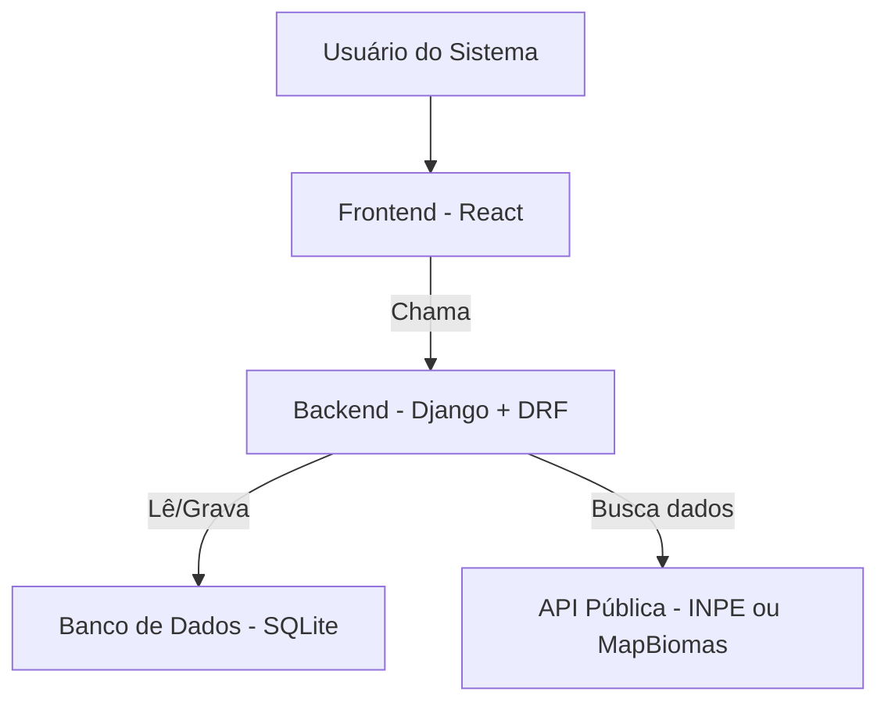

# Documentação da Arquitetura

## 1. Escolhas de Tecnologias

- **Frontend**: React (interface interativa com gráficos e filtros)
- **Backend**: Django + Django Rest Framework (API para processar os dados)
- **Banco de Dados**: SQLite (armazenamento local)
- **APIs Externas**: INPE, MapBiomas (fontes de dados públicos)

---

### Nível 2 - Diagrama de Contêineres

### Nível 3 - Justificativa do Modelo 

Foi escolhida uma arquitetura monolítica, com Django no back-end e React no front-end, pois ela permite uma integração simples e eficiente entre os dois. O Django gerencia o banco de dados e as APIs, enquanto o React proporciona uma interface interativa para o usuário. A escolha por uma arquitetura monolítica facilita o desenvolvimento inicial e a manutenção do projeto, permitindo ajustes futuros caso o sistema precise de mais escalabilidade, sem prejudicar a estrutura

